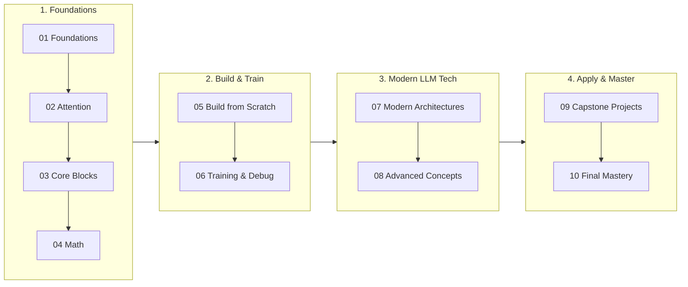

<h1 align="center">Transformer Mastery</h1>

<p align="center">
  <b>Build a Transformer from scratch, and understand every tensor shape along the way.</b><br>
  A structured, code-first course: clear theory, mathematical intuition, and interactive Jupyter Notebooks<br>
  from foundational attention to modern LLM architectures.
</p>

<div align="center">

[](https://www.python.org/downloads/)
[](https://pytorch.org/get-started/locally/)
[](https://jupyter.org/)
[](00-roadmap/learning-roadmap.md)
[](09-projects/)
[](https://github.com/himanshu-jadhav108/Transformer-Mastery/actions/workflows/smoke-test.yml)
[](LICENSE)
[](#contributing)

**[Get started](GETTING_STARTED.md)** ·
**[Course Roadmap](#course-roadmap)** ·
**[Interactive Notebooks](#interactive-jupyter-notebooks)** ·
**[Choose your track](#choose-your-track)** ·
**[FAQ](#faq)**

</div>

---

## Current Status

- **Core Curriculum (Modules 00–08, 10):** **100% Complete.** All concept lessons, mathematical derivations, cheatsheets, and interactive Jupyter Notebooks are fully written and verified.
- **Capstone Projects (Module 09):** Comprehensive architectural specifications and project briefs are ready for all four projects (`01` through `04`). Dedicated step-by-step Jupyter Notebooks for each project are actively in development and will be added in an upcoming update.

---

## Why this course

Most Transformer material either stays at the high-level API layer or drowns you in abstract equations. This course bridges the gap: you study the mechanics, run interactive Jupyter Notebooks, and see the tensors transform at every layer.

- **Shape-first.** Every major operation is explicitly traced through `(B, T, C)`, `(B, h, T, d_k)` and related projections, so you always know what goes in and what comes out.
- **Notebook-driven.** Every core module features a dedicated, self-contained Jupyter Notebook (`.ipynb`) with step-by-step cell executions, intermediate tensor prints, and visual plots.
- **Break it on purpose.** Learn how to diagnose shape mismatches, causal masking bugs, and NaN gradient blowups directly within interactive notebook environments.
- **Classic to modern.** Build up from scaled dot-product attention to modern LLM techniques: RoPE (Rotary Position Embeddings), KV caching, Flash Attention concepts, and Mixture-of-Experts (MoE).
- **Full GPT from scratch.** Construct an end-to-end decoder-only GPT model from raw PyTorch in `05-build-from-scratch/GPT_From_Scratch.ipynb` and prepare for ML engineering interviews with `10-mastery/`.

The implementations follow a strict shape-annotated style:

```python
def scaled_dot_product_attention(q, k, v, mask=None):
    # q, k: (B, h, T, d_k)    v: (B, h, T, d_v)
    d_k = q.size(-1)
    scores = (q @ k.transpose(-2, -1)) / (d_k ** 0.5)  # (B, h, T, T)
    if mask is not None:
        scores = scores.masked_fill(mask == 0, float("-inf"))
    weights = scores.softmax(dim=-1)                    # (B, h, T, T)
    return weights @ v, weights                         # (B, h, T, d_v)
```

```text
[Input Tokens: (B, T)] 
        ↓  Token Embedding + Positional Encoding
  [(B, T, C)]
        ↓  Linear Projections (W_q, W_k, W_v) & Multi-Head Reshape
  [(B, h, T, d_k)]
        ↓  Attention Matrix: Softmax((Q @ K^T) / sqrt(d_k))
  [(B, h, T, T)] × Value [(B, h, T, d_v)]
        ↓  Concatenate Heads & Output Projection W_o
  [(B, T, C)]
```

---

## What you will be able to do

By completing this course, you will be able to:

- Explain why attention-based mechanisms replaced recurrent architectures (RNNs/LSTMs) for sequence modeling.
- Derive and implement scaled dot-product, self-attention, cross-attention, causal attention, and multi-head attention.
- Track tensor shapes across embeddings, linear projections, attention masks, residual connections, and normalization (LayerNorm and RMSNorm).
- Build a complete Encoder-Decoder and Decoder-only GPT Transformer from scratch in PyTorch.
- Compare BERT, GPT, T5, LLaMA, Vision Transformers (ViT), and multimodal architectures.
- Implement modern efficiency techniques: RoPE, KV caching, Flash Attention concepts, and MoE routing.
- Train, evaluate, optimize, and debug small Transformer models on CPU or GPU.
- Tackle applied capstone projects and answer technical Transformer interview questions with confidence.

---

## Quick start

Get up and running in about 10 minutes on macOS, Linux, or Windows (Python 3.9+ and Git required):

```bash
git clone https://github.com/himanshu-jadhav108/Transformer-Mastery.git
cd Transformer-Mastery

# Create and activate virtual environment
python -m venv .venv                     # Windows: py -m venv .venv
source .venv/bin/activate                # Windows PowerShell: .\.venv\Scripts\Activate.ps1

# Install dependencies
python -m pip install --upgrade pip
python -m pip install -r requirements.txt

# Verify environment
python scripts/check_env.py
```

### Launching the Course Notebooks

Open the project folder in **VS Code**:
```bash
code .
```
Navigate to `02-attention/Practice_02.ipynb`, select the `.venv` Python kernel in the top-right corner, and run the cells!

Prefer running in a browser?
```bash
jupyter lab    # or: jupyter notebook
```

Prefer zero local setup? Launch directly in [GitHub Codespaces](https://codespaces.new/himanshu-jadhav108/Transformer-Mastery).

**Full instructions and troubleshooting are in [GETTING_STARTED.md](GETTING_STARTED.md).**

---

## Course roadmap

Study the modules in order. Each module includes both conceptual lessons and a hands-on Jupyter Notebook:



| Module | Core Topics | Interactive Notebook | Status |
| --- | --- | --- | :---: |
| [`00-roadmap/`](00-roadmap/) | Course map, milestones, and tracker | [`learning-roadmap.md`](00-roadmap/learning-roadmap.md) | Ready |
| [`01-foundations/`](01-foundations/) | Word embeddings, sequence modeling, RNNs, LSTMs, GRUs, why Transformers | `Practice_01.ipynb` | Ready |
| [`02-attention/`](02-attention/) | QKV intuition, scaled dot-product, self/cross/causal attention, MHA, GQA | `Practice_02.ipynb` | Ready |
| [`03-transformer-core/`](03-transformer-core/) | Positional encodings, FFN, SwiGLU, LayerNorm, RMSNorm, encoder/decoder | `Practice_03.ipynb` | Ready |
| [`04-mathematics/`](04-mathematics/) | Tensor geometry, broadcasting, matrix operations, `einsum`, backprop | `Practical_04.ipynb` | Ready |
| [`05-build-from-scratch/`](05-build-from-scratch/) | Step-by-step reconstruction of full Decoder-only GPT model | `GPT_From_Scratch.ipynb` | Ready |
| [`06-training/`](06-training/) | Training loops, schedulers, checkpointing, shape & masking diagnostics | `06-Training.ipynb` | Ready |
| [`07-modern-transformers/`](07-modern-transformers/) | BERT, GPT-2/3, T5, LLaMA, Vision Transformer (ViT), multimodal systems | `Modern-Transformer-Family.ipynb` | Ready |
| [`08-advanced-concepts/`](08-advanced-concepts/) | KV caching, RoPE, Flash Attention, MoE, decoding (Greedy, Top-k, Top-p) | `Adevanced-Concepts.ipynb` | Ready |
| [`09-projects/`](09-projects/) | 4 Capstone projects: Visualizer, Text Classifier, Mini LM, Mini GPT | Architecture specs ready (Notebooks coming soon) | Specs Ready |
| [`10-mastery/`](10-mastery/) | Revision cheatsheets, 20 common pitfalls, ML interview questions, checklist | Cheatsheets & Review guides | Ready |

---

## Interactive Jupyter Notebooks

Every core module features a dedicated, hands-on notebook:

1. **`01-foundations/Practice_01.ipynb`** — Vectors, word embeddings, RNN forward pass, and sequence modeling.
2. **`02-attention/Practice_02.ipynb`** — Manual attention math, QKV projections, self-attention, and attention heatmaps.
3. **`03-transformer-core/Practice_03.ipynb`** — Positional encodings (sinusoidal & learned), feed-forward networks, and normalization layers.
4. **`04-mathematics/Practical_04.ipynb`** — Tensor manipulation, broadcasting, matrix multiplication, and `einsum` mastery.
5. **`05-build-from-scratch/GPT_From_Scratch.ipynb`** — Full end-to-end decoder-only GPT model built cell-by-cell.
6. **`06-training/06-Training.ipynb`** — Training loop implementation, learning rate schedules, and common training bugs.
7. **`07-modern-transformers/Modern-Transformer-Family.ipynb`** — Exploring BERT, GPT, and modern Transformer family architectures.
8. **`08-advanced-concepts/Adevanced-Concepts.ipynb`** — Advanced inference optimizations: RoPE, KV cache, and Mixture-of-Experts.

---

### Choose your track

Pick the path that matches your current goal:

| Goal | Recommended Path | Estimated Time |
| --- | --- | :---: |
| **Complete Mastery** | Modules `00` → `10` in sequence | 40–50 hrs |
| **Build & Train Your Own GPT** | Modules `02` → `03` → `05` → `06` | 18–23 hrs |
| **Interview Preparation** | Modules `02` → `03` → `08` → `10` | 14–18 hrs |
| **Catch Up on Modern LLMs** | Modules `07` → `08` | 6–8 hrs |

---

## Tensor-shape conventions

The course adheres strictly to these shape symbols:

| Symbol | Meaning |
| --- | --- |
| `B` | Batch size |
| `T` | Sequence length (tokens) |
| `C` or `d_model` | Model embedding dimension |
| `h` | Number of attention heads |
| `d_k` | Query/Key dimension per head (`C // h`) |
| `d_v` | Value dimension per head (`C // h`) |

Standard token representations are formatted as `(B, T, C)`. Multi-head projections reshape to `(B, h, T, d_k)` or `(B, h, T, d_v)`.

---

## Repository structure

```text
Transformer-Mastery/
├── README.md                           # Main course guide & overview
├── GETTING_STARTED.md                  # Comprehensive setup & troubleshooting
├── LICENSE                             # MIT License
├── requirements.txt                    # Core dependencies (PyTorch, NumPy, Matplotlib, ipykernel)
├── .github/
│   └── workflows/
│       └── smoke-test.yml              # CI workflow validating dependencies & environment
├── scripts/
│   └── check_env.py                    # Environment & hardware accelerator diagnostic
├── 00-roadmap/                         # Learning roadmap & tracker
│   └── learning-roadmap.md
├── 01-foundations/                     # RNN, LSTM, GRU theory & Practice_01.ipynb
├── 02-attention/                       # Attention theory & Practice_02.ipynb
├── 03-transformer-core/                # Encoder/decoder blocks & Practice_03.ipynb
├── 04-mathematics/                     # Tensor mechanics & Practical_04.ipynb
├── 05-build-from-scratch/              # Full GPT_From_Scratch.ipynb & 00-CODE-MAP.md
├── 06-training/                        # Training loop, loss & 06-Training.ipynb
├── 07-modern-transformers/             # BERT, GPT, LLaMA & Modern-Transformer-Family.ipynb
├── 08-advanced-concepts/               # RoPE, KV cache, MoE & Adevanced-Concepts.ipynb
├── 09-projects/                        # 4 Capstone project blueprints (Notebooks coming soon)
└── 10-mastery/                         # Revision cheatsheets, interview QA & checklist
```

---

## FAQ

<details>
<summary><b>Do I need an expensive GPU?</b></summary>

No. All models in the curriculum are intentionally sized so they run easily on standard CPU hardware. A GPU only speeds up the optional training loops in Module 06. Run `python scripts/check_env.py` to see whether PyTorch detects a CUDA GPU, Apple Silicon MPS, or CPU.
</details>

<details>
<summary><b>How do I run the Jupyter Notebooks?</b></summary>

The easiest way is to open the repository in **VS Code**, install the **Python** and **Jupyter** extensions, open any `.ipynb` file, and select the `.venv` interpreter kernel. Alternatively, launch `jupyter lab` or `jupyter notebook` from your terminal.
</details>

<details>
<summary><b>What is in <code>05-build-from-scratch/</code>?</b></summary>

Module 05 features `GPT_From_Scratch.ipynb`, which walks through an end-to-end reconstruction of a decoder-only GPT model from raw PyTorch operations. It also includes `00-CODE-MAP.md`, which cross-references core components.
</details>

<details>
<summary><b>When will the Capstone Project notebooks be added?</b></summary>

The architectural specifications, concept maps, and expected outcomes for all 4 projects in `09-projects/` are ready now. Dedicated, step-by-step companion notebooks for each project are actively being finalized and will be pushed soon.
</details>

<details>
<summary><b>Does this work on Windows, macOS, and Linux?</b></summary>

Yes, fully cross-platform. See [GETTING_STARTED.md](GETTING_STARTED.md) for OS-specific environment activation steps.
</details>

---

## Contributing

Contributions, typo fixes, and conceptual clarifications are welcome! Please:
- Ensure all notebook outputs run cleanly end-to-end.
- Explicitly document tensor shapes for intermediate transformations.
- Run `python scripts/check_env.py` to verify environment compatibility.

If this course helped you master Transformers, consider leaving a ⭐ on GitHub!

---

## References and further reading

- [Attention Is All You Need](https://arxiv.org/abs/1706.03762) (Vaswani et al., 2017)
- [BERT: Pre-training of Deep Bidirectional Transformers](https://arxiv.org/abs/1810.04805) (Devlin et al., 2018)
- [LLaMA: Open and Efficient Foundation Language Models](https://arxiv.org/abs/2302.13971) (Touvron et al., 2023)
- [FlashAttention: Fast and Memory-Efficient Exact Attention](https://arxiv.org/abs/2205.14135) (Dao et al., 2022)
- [RoFormer: Enhanced Rotary Position Embedding](https://arxiv.org/abs/2104.09864) (Su et al., 2021)
- [The Annotated Transformer](https://nlp.seas.harvard.edu/annotated-transformer/) (Harvard NLP)
- [nanoGPT](https://github.com/karpathy/nanoGPT) (Andrej Karpathy)

---

## Citation

```bibtex
@misc{jadhav2026transformermastery,
  author       = {Jadhav, Himanshu},
  title        = {Transformer Mastery: A Code-First Course on Transformer Architecture},
  year         = {2026},
  howpublished = {\url{https://github.com/himanshu-jadhav108/Transformer-Mastery}}
}
```

---

## 👤 Maintainer

<br>

<p align="center">
  <table align="center" style="border: 1px solid rgba(255,255,255,0.1); border-radius: 16px; background: rgba(30, 41, 59, 0.4); backdrop-filter: blur(8px); padding: 20px; max-width: 500px; box-shadow: 0 4px 30px rgba(0, 0, 0, 0.3);">
    <tr>
      <td align="center">
        <h3 style="margin: 0; color: #38bdf8; font-size: 1.6em; font-weight: 800; letter-spacing: -0.5px;">Himanshu Jadhav</h3>
        <p style="color: #94a3b8; font-weight: 500; margin: 4px 0 15px 0;">Artificial Intelligence & Data Science Engineer</p>
        <p style="color: #cbd5e1; font-size: 0.95em; max-width: 400px; line-height: 1.5; margin-bottom: 20px;">
          Passionate about deep learning architectures, Transformer models, real-world localized model deployment, and high-performance pipeline architecture.
        </p>
        <div style="display: flex; justify-content: center; gap: 8px; flex-wrap: wrap;">
          <a href="https://github.com/himanshu-jadhav108" target="_blank"></a>
          <a href="https://www.linkedin.com/in/himanshu-jadhav-328082339" target="_blank"></a>
          <a href="https://himanshu-jadhav-portfolio.vercel.app/" target="_blank"></a>
          <a href="https://www.instagram.com/himanshu_jadhav_108" target="_blank"></a>
        </div>
      </td>
    </tr>
  </table>
</p>

<br>

---

<div align="center">

**If you found this course helpful, please consider giving it a ⭐!**

[Back to Top](#transformer-mastery)

</div>

